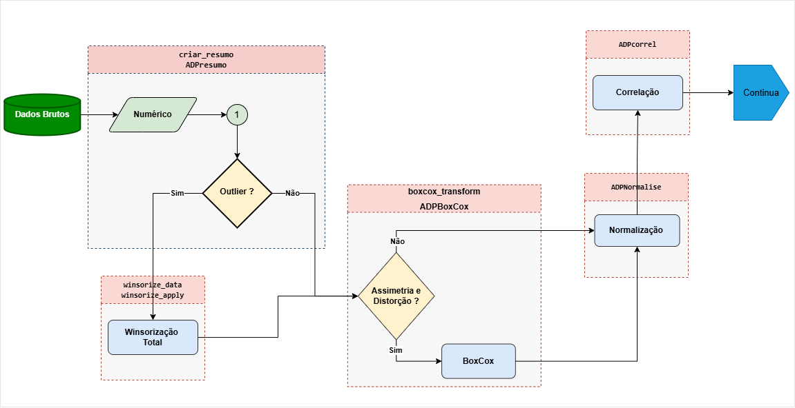

<div style="text-align: justify; width: 100%; margin: auto; font-size: 1em;">

## Resumo
 O pacote **reprodutibilidade** foi desenvolvido para apoiar as etapas de elaboração dos indicadores da plataforma **AdaptaBrasil**. Como o processo de criação dos índices e indicadores envolve diversas fases — incluindo validação e análises estatísticas — o pacote oferece funções que facilitam a criação, verificação e divulgação dos resultados de forma rastreável e reprodutível.

</div>

## Introdução 

O fluxograma apresentado ilustra o fluxo de tratamento e preparação dos dados dentro do processo analítico da plataforma AdaptaBrasil. Ele representa a sequência de etapas aplicadas aos dados brutos antes da execução das análises estatísticas e da construção dos indicadores.

<figure style="text-align: justify; width: 100%; margin: auto;">


<figcaption style="text-align:left; font-size:0.95em; margin-top:6px;">
    Figura 1: Fluxo de tratamento e preparação dos dados brutos, incluindo etapas de verificação, transformação e normalização para garantir consistência e reprodutibilidade estatística.
  </figcaption>
</figure>

#####

O processo inicia com a verificação do tipo de variável, diferenciando dados do tipo Score de variáveis numéricas. Para variáveis numéricas, ocorre a identificação de outliers e, se necessário, aplica-se a winsorização, que reduz o impacto de valores extremos sem removê-los. Em seguida, os dados são avaliados quanto à assimetria e curtose, de modo a identificar distorções na distribuição. Quando essas distorções são significativas, utiliza-se a transformação Box-Cox, que corrige desvios de normalidade e estabiliza a variância.

Após o ajuste da distribuição, os dados passam pela normalização, permintido a comparabilidade entre diferentes variáveis e unidades de medida. Por fim, realiza-se a análise de correlação, que permite avaliar as relações entre os indicadores e seguir para as etapas subsequentes de modelagem e composição dos índices.

Esse fluxo propricia reprodutibilidade e consistência estatística dos dados processados, consolidando a qualidade das informações analisadas. Para iniciar, é necessario instalar o pacote disponivel no GitHub, sendo inicialmente desenvolvido em ambiente windows 11.

```{r, eval = FALSE}
devtools::install_github("AdaptaBrasil/reprodutibilidade")
```


## Carregando o pacote 

```{r, eval = FALSE}
require(reprodutibilidade)
```

## Lendo arquivos de entrada 

```{r, eval = FALSE}

library("reprodutibilidade")

inxlsx <- openxlsx::loadWorkbook(file = "DATASET/Base_inicial_SA_Acesso.xlsx")

```

Lendo as planilhas do arquivo, nesse caso a planilha metadados, contem as informações sobre os indicadores que serão analisados como: 

<style>
.textbox{
  background: #f7f7f7; border-left: 4px solid #007bff;
  padding: 12px 16px;
  border-radius: 4px;
  margin: 12px 0;
}

.textbox-offset{ margin-left: 40px; margin-right: 12px; 
}
</style>

<div class="textbox textbox-offset">

* **N**      - Contador simples.
* **NIVEL**  - Nivel do Índice/Indicador.
* **CODE**   - Sigla para indexação do Índice/Indicador.
* **NOME**   - Descrição completa do título do Índice/Indicador.
* **TIPO**   - Categoria do Índice/Indicador. 
* **PAI**    - Informa a qual Índice/Indicador está relacionado no nível acima. 
* **CLASSE** - Informa a categoria que serão aplicadas as operações. Se **_Numerico_** operações padrões, se **_Descrição_** utilizado apenas para indexação.

</div>


<div style="text-align: justify; width: 100%; margin: auto; font-size: 1em;">

Enquanto a planilha _"Dados_SA_Acesso"_ contém nas três (3) colunas iniciais as informações de georeferenciamento como: GEOCOD, NOME do Município, Unidade Federativa (UF), em seguida deve conter as colunas referentes aos índices/indicadores descritos na planilha metadados, sendo que o número total de linhas deve ser igual ao numero total de municípios avaliados e o número total de colunas deve ser igual ao numero ao valor máximo encontrado na coluna _**N**_ dos metadados.  
A Figura abaixo ilustra as planilhas usadas no fluxo do pacote — contém exemplos de formatos e campos esperados (georeferenciamento, nome do município, estado, região e cluster). Na planilha **Dados_SA_Acesso** — as coluna 1–3 são referências, as demais colunas correspondem aos indicadores por município.
</div>
#

<figure style="text-align: justify; width: 100%; margin: auto;">


<figcaption style="text-align:left; font-size:0.95em; margin-top:6px;">
    Figura 1: Exemplo das planilhas de entrada do pacote reprodutibilidade, planilhas Metadados e Dados_RA_Acesso. 
  </figcaption>
</figure>


##
```{r, eval = TRUE}
  
  library("reprodutibilidade")

  resultado <- read_exemplo_xlsx()

  metadados <- resultado$metadados
  dataset  <- resultado$dataset

  # Recortando apenas os dados do Nivel 7
  metadadosN7 = subset(metadados,metadados$Nivel==7)

  # Selecionando apenas as referencias 
  data_ref = dataset[,c(1:3)]

  # Selecionando todos os dados   
  datasetN7 = round(dataset[,-c(1:3)],2)

  #Atribuindo nome as colunas
  colnames(datasetN7) <- colnames(dataset[,-c(1:3)])

```

## Aplicando as Funções Básicas
### _Resumo_ 

#### criar_resumo<i>(dataset, class_type, nome)</i>
Essa função obtem estastitiscas básicas de apenas um único indicador, para executar o cálculo de forma correta, atentar para objeto _class_type_ que se refere a classe do objeto, sendo um objeto _Numérico_ é a escrita deve ser a seguinte: **"Numerico"**. 
```{r, echo=TRUE, eval=TRUE, results='markup',fig.width=6.8, fig.height=4, dpi=100}
library("reprodutibilidade")

# Carregando a base de dados de exemplo
data("datasetN7", package = "reprodutibilidade")

idx_MMPD = datasetN7$MMPD
nome = "MMPD"

res1 = criar_resumo(idx_MMPD,"Numerico" , "MMPD")

print_summary(res1)

criar_grafico(idx_MMPD, plot=TRUE, nome_arquivo = "grafico_combinado.png", 
              largura = 10, altura = 5, dpi = 25, 
              nvalores="MMPD",fsize=6)

```

#### ADPresumo _(dataset, class_types, clusters, nomes)_
A função _ADPresumo(dataset, class_types, clusters, nomes)_ executa a geração padronizada de resumos descritivos para cada variável de um conjunto de dados.

O procedimento interno da função envolve:

<div class="textbox textbox-offset">

* Verificação da consistência entre o número de colunas do dataset e os vetores informados;

* Resumir as medidas descritivas de cada variavel;

* Combinação dos resultados em um único quadro (resumo_combinado);

</div>

Gerando três objetos de saída:

* _resumo_total_: resumo completo de todas as variáveis;

* _resumo_basico_: tabela transposta com estatísticas principais;

* _resumo_na_: resumo focado em valores ausentes.

```{r, eval = TRUE}

library("reprodutibilidade")
# Carregando a base de dados de exemplo

# Metadados
data("metadadosN7", package = "reprodutibilidade")

# Dataset 
data("datasetN7", package = "reprodutibilidade")

# Dataset referencia
data("data_ref", package = "reprodutibilidade")

resumo <- ADPresumo(datasetN7, 
                    metadadosN7$CLASSE,  
                    colnames(datasetN7))

print(resumo$resumo_total)                    
```

### _Winsorization_
Essas funções tem como objetivo reduzir o impacto dos valores extremos (_outliers_) do conjunto de dados, reprojetando os mesmos para valores próximos a limiares baseados nos percentis inferiores e superiores de cada variável.

#### winsorize_info(<i>indice, classe_label = NULL, var_name=NULL</i>)
```{r, eval = TRUE}
library("reprodutibilidade")

# Carregando a base de dados de exemplo
data("metadadosN7", package = "reprodutibilidade")

data("datasetN7", package = "reprodutibilidade")

idx_MMPD = datasetN7$MMPD
nome = "MMPD"

res1 = winsorize_info(idx_MMPD,"Numerico" , "MMPD")

print_summary(res1)


```
#### winsorize_data( _dataset_, _metadados_)

```{r, eval = TRUE}

winsorize_data(dataset = datasetN7, 
               metadados = metadadosN7)
```

```{r, eval = TRUE, fig.width=6.8, fig.height=4, dpi=100}

data_winsor <- winsorize_apply(dataset=datasetN7,
                              metadados=metadadosN7)

plot(idx_MMPD,data_winsor$dataset$MMPD,
      main = paste0("Comparação dados sem Winzorise X Dados com Winzorise  \n Indicador: ",nome),
      cex.axis=1,las=1,ylab="Dados Transformados",
      xlab="Reference", cex.lab=0.8,cex.main=1) 

```

### _BoxCox_
Essa função aplica da trnasformada BoxCox buscando corrigir assietria e estabilizar a variância, aproximando de uma distribuição normal.

#### boxcox_transform(<i>value, metodo=c("forecast", "COINr", "yeojohnson")</i>)
```{r, eval = TRUE,fig.width=6.8, fig.height=4, dpi=100}

library("reprodutibilidade")

# Carregando a base de dados de exemplo
data("metadadosN7", package = "reprodutibilidade")
data("datasetN7", package = "reprodutibilidade")

dados <- datasetN7[,19]

# Aplicando Box-Cox com pacote forecast
bxcx.fcs <- boxcox_transform(dados, metodo = "forecast")
 
# Aplicando Box-Cox com o COINr
bxcx.coin <- boxcox_transform(dados,metodo = "COINr")
 
# Aplicando Yeo-Johnson
bxcx.yjn <- boxcox_transform(dados, metodo = "yeojohnson")

par(mfrow=c(1,3)) ; par(mar=c(5,4,6,1))
 
 plot(sort(dados),sort(bxcx.fcs),
      main = "Transformacao BoxCox \n via pacote Forecast",
      cex.axis=1,las=1,ylab="Transformada BoxCox",
      xlab="Reference", cex.lab=0.8,cex.main=1) 
 
 plot(sort(dados),sort(bxcx.coin),
      main = "Transformacao BoxCox \n via pacote COINr",
      cex.axis=1,las=1,ylab="Transformada BoxCox",
      xlab="Reference",cex.lab=0.8,cex.main=1) 
 
 plot(sort(dados),sort(bxcx.yjn),
      main = "Transformacao BoxCox \n via pacote bestNormalize::Yeojohnson",
      cex.axis=1,las=1,ylab="Transformada BoxCox",
      xlab="Reference",cex.lab=0.8,cex.main=1)
```

#### ADPBoxCox(<i>dadoswin=NULL, dados_originais=NULL, classe=NULL, nome=NULL, metodo=NULL</i>)
```{r, eval = TRUE}
method_boxcox = "forecast"

data_bxcx <- ADPBoxCox(dadoswin=data_winsor$dataset,
                      dados=datasetN7,
                      classe=metadadosN7$CLASSE,
                      nome=colnames(datasetN7),
                      metodo=method_boxcox)
```                     
### _Normalização_
#### ADPNormalise(<i>iData</i>)
```{r, eval = TRUE}
data_normal <- ADPNormalise(data_bxcx$data)
```

### _Tratamento_
#### Tratamento(<i>input="INPUT.xlsx", metadados = "Plan_Metadados",  dataset  = "Plan_Dados", method_boxcox = NULL, sigla=NULL, subsetor=NULL</i>)
Excutando a função que aplica as métricas, 
Cria uma lista chamado result, onde estão os resultados 
das metricas aplicadas.  
Salvando em dois (2) arquivos .xlsx no diretório OUTPUT 

* O primeiro ANALISE_DESCRITIVA_SETOR_DATA_HORA.xlsx
* O segundo DADOS_TRATADOS_SETOR_DATA_HORA.xlsx

```{r, eval = TRUE}
caminho_arquivo <- system.file("dataset", "Base_inicial_SA_Acesso.xlsx", package = "reprodutibilidade")

result = Tratamento(input=caminho_arquivo,
           metadados = "metadados",
           dataset = "dados_SA_Acesso",
           nivel=7,
           method_boxcox="forecast",
           sigla = "SE",
           subsetor= NULL)
```


## Aplicando as Funções Análise
### _Correlação_ 

#### total_na<i>(indice)</i>
```{r, eval = TRUE}
total.na(datasetN7$MMPD)
```

#### get_max_cor <i>(var_name,cor_matrix=NULL)</i>
```{r, eval = TRUE}
mat <- cor(mtcars)
get_max_cor("mpg", mat)
```

#### ADPcorrel<i>(x)</i>
```{r, eval = TRUE}
res <- ADPcorrel(result$Data_Normal$dataset)
head(res$cor_summary)
```


#### correl_ind<i>(x)</i>
```{r, eval = TRUE,fig.width=7.2, fig.height=5}

result_cor <- correl_ind(result$Data_Normal$dataset)

head(result_cor$Resumo)

FigContNA(result_cor$Contagem_NA,nfile="Contagem_NA_ISimples.png",visivel=TRUE)

```

#### FigCorrelPlot<i>(result_cor$Correl,tipo="Total",nfile="FIGs/Correlação_Total.png")</i>
```{r, eval = TRUE,fig.width=7.2, fig.height=5}
 FigCorrelPlot(result_cor$Correl,tipo="Total",save=FALSE,nfile="FIGs/Correlação_Total.png")
```