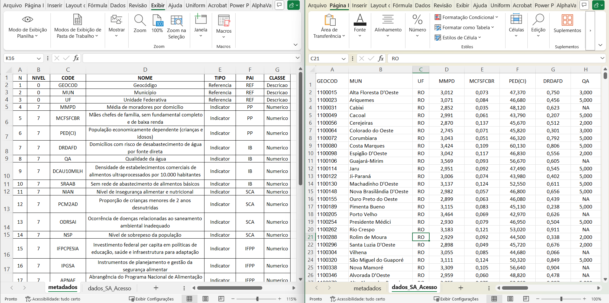

<div style="text-align: justify; width: 100%; margin: auto; font-size: 1em;">

## Resumo
 O pacote **reprodutibilidade** foi desenvolvido para apoiar as etapas de elaboração dos indicadores da plataforma **AdaptaBrasil**. Como o processo de criação dos índices e indicadores envolve diversas fases — incluindo validação e análises estatísticas — o pacote oferece funções que facilitam a criação, verificação e divulgação dos resultados de forma rastreável e reprodutível.

</div>

## Introdução 

O fluxograma apresentado ilustra o fluxo de tratamento e preparação dos dados dentro do processo analítico da plataforma AdaptaBrasil. Ele representa a sequência de etapas aplicadas aos dados brutos antes da execução das análises estatísticas e da construção dos indicadores.

<figure style="text-align: justify; width: 100%; margin: auto;">


<figcaption style="text-align:left; font-size:0.95em; margin-top:6px;">
    Figura 1: Fluxo de tratamento e preparação dos dados brutos, incluindo etapas de verificação, transformação e normalização para garantir consistência e reprodutibilidade estatística.
  </figcaption>
</figure>

#####

O processo inicia com a verificação do tipo de variável, diferenciando dados do tipo Score de variáveis numéricas. Para variáveis numéricas, ocorre a identificação de outliers e, se necessário, aplica-se a winsorização, que reduz o impacto de valores extremos sem removê-los. Em seguida, os dados são avaliados quanto à assimetria e curtose, de modo a identificar distorções na distribuição. Quando essas distorções são significativas, utiliza-se a transformação Box-Cox, que corrige desvios de normalidade e estabiliza a variância.

Após o ajuste da distribuição, os dados passam pela normalização, permintido a comparabilidade entre diferentes variáveis e unidades de medida. Por fim, realiza-se a análise de correlação, que permite avaliar as relações entre os indicadores e seguir para as etapas subsequentes de modelagem e composição dos índices.

Esse fluxo propricia reprodutibilidade e consistência estatística dos dados processados, consolidando a qualidade das informações analisadas. Para iniciar, é necessario instalar o pacote disponivel no GitHub, sendo inicialmente desenvolvido em ambiente windows 11.

```{r, eval = FALSE}
devtools::install_github("AdaptaBrasil/reprodutibilidade")
```


## Carregando o pacote 

```{r, eval = FALSE}
require(reprodutibilidade)
```

## Lendo arquivos de entrada 

```{r, eval = FALSE}
library("reprodutibilidade")
inxlsx <- openxlsx::loadWorkbook(file = "DATASET/Base_inicial_SA_Acesso.xlsx")
  name_meta = "Metadados"
  name_data = "Dados_RA_Acesso"
```

Lendo as planilhas do arquivo, nesse caso a planilha metadados, contem as informações sobre os indicadores que serão analisados como: 

* Nome 
* Tipo 
* Pai 
* Categoria 


<div style="text-align: justify; width: 100%; margin: auto; font-size: 1em;">

Enquanto a planilha _"Dados_RA_Acesso"_ contém os dados de georeferenciamento, tipo GEOCOD, NOME do Municpio, Estado, Região e Cluster <span style="color:red;">(esse elemento será explicado futuramente)</span> de cada indicador simples, o número total de linhas deve ser igual ao numero total de municípios avaliados. e o número total de colunas deve ser igual ao numero <span style="color:red;">XX </span>.  
A Figura abaixo ilustra as planilhas usadas no fluxo do pacote — contém exemplos de formatos e campos esperados (georeferenciamento, nome do município, estado, região e cluster). Na plnailha **Dados_RA_Acesso** — as coluna 1–4 são referências, as demais colunas correspondem aos indicadores por município.
</div>
#

<figure style="text-align: justify; width: 100%; margin: auto;">


<figcaption style="text-align:left; font-size:0.95em; margin-top:6px;">
    Figura 1: Exemplo das planilhas de entrada do pacote reprodutibilidade, planilhas Metadados e Dados_RA_Acesso. 
  </figcaption>
</figure>

###
```{r, eval = FALSE}
  metadados <- openxlsx::read.xlsx(inxlsx, sheet = name_meta)
  dataset  <- openxlsx::read.xlsx(inxlsx, sheet = name_data)

  # Recortando apenas os dados do Nivel 7
  metadadosN7 = subset(metadados,metadados$Nivel==7)

  # Selecionando apenas as referencias 
  data_ref = dataset[,c(1:4)]

  # Selecionando todos os dados   
  datasetN7 = round(dateset[,-c(1:4)],2)

  #Atribuindo nome as colunas
  colnames(datasetN7) <- colnames(dataset[,-c(1:4)])
```

#### _Aplicando as Funções de Resumo_ 
<span style="color:red;"> Essa função obtem estastitiscas básicas de apenas um unico indicador, para o calcúlo ser executado de forma correta, atentar para o segundo objeto inserido no indicador, que se refere a classe do objeto, caso ele seja _Numérico_ é necessario que seja escrito da seguinte forma: **"Numerico"**. </span>

```{r, echo=TRUE, eval=TRUE, results='markup'}

library("reprodutibilidade")
# Carregando a base de dados de exemplo
data("iData_N7", package = "reprodutibilidade")

idx_MMPD = iData_N7$MMPD
nome = "MMPD"

res1 = criar_resumo(idx_MMPD,"Numerico" , cluster = NULL, "MMPD")

t(as.data.frame(res1))

```


```{r, eval = FALSE}

library("reprodutibilidade")
# Carregando a base de dados de exemplo
data("iMeta_N7", package = "reprodutibilidade")
data("iData_N7", package = "reprodutibilidade")

# Selecionando apenas as referencias 
data_ref = iData_N7[,c(1:4)]

resumo <- ADPresumo(iData_N7, 
                    iMeta_N7$Classe, 
                    data_ref[,4], 
                    colnames(iData_N7))
```

#### _Aplicando as Funções de Winsorization_
<span style="color:red;"> Essa função tem como objetivo reduzir o impacto dos valores extremos (_outliers_) do conjunto de dados, reprojetando os mesmos para valores proximos a limiares definidos baseados no percentis inferiores e superiores.  </span>

```{r, eval = FALSE}

library("reprodutibilidade")
# Carregando a base de dados de exemplo
data("iMeta_N7", package = "reprodutibilidade")
data("iData_N7", package = "reprodutibilidade")


winsorize_data(dataset=iData_N7, 
               metadados=iMeta_N7,
               cluster_ref=data_ref[,4])

data_winsor <- winsorize_apply(dataset=iData_N7,
                              metadados=iMeta_N7,
                              cluster_ref=data_ref[,4])

```
#### _Aplicando as Funções BoxCox_
<span style="color:red;"> Essa função aplica da trnasformada BoxCox buscando corrigir assietria e estabilizar a variância, aproximando de uma distribuição normal.  </span>


```{r, eval = FALSE}

library("reprodutibilidade")

# Carregando a base de dados de exemplo
data("iMeta_N7", package = "reprodutibilidade")
data("iData_N7", package = "reprodutibilidade")

dados <- iMeta_N7[,7]

# Aplicando Box-Cox com pacote forecast
bxcx.fcs <- boxcox_transform(dados, metodo = "forecast")
 
# Aplicando Box-Cox com o COINr
bxcx.coin <- boxcox_transform(dados,metodo = "COINr")
 
# Aplicando Yeo-Johnson
bxcx.yjn <- boxcox_transform(dados, metodo = "yeojohnson")
 
par(mfrow=c(1,3)) ; par(mar=c(5,5,6,1))
 
 plot(c(1:length(dados)),bxcx.fcs,
      main = "Transformacao BoxCox \n via pacote Forecast",
      cex.axis=1.5,las=1,ylab="Transformada BoxCox",
      xlab="Reference", cex.lab=1.8,cex.main=2) 
 
 plot(c(1:length(dados)),bxcx.coin,
      main = "Transformacao BoxCox \n via pacote COINr",
      cex.axis=1.5,las=1,ylab="Transformada BoxCox",
      xlab="Reference",cex.lab=1.8,cex.main=2) 
 
 plot(c(1:length(dados)),bxcx.yjn,
      main = "Transformacao BoxCox \n via pacote bestNormalize::Yeojohnson",
      cex.axis=1.5,las=1,ylab="Transformada BoxCox",
      xlab="Reference",cex.lab=1.8,cex.main=2)
```

```{r, eval = FALSE}
data_bxcx <- ADPBoxCox(dadoswin=data_winsor$dataset,
                      dados=iData_N7,
                      classe=iMeta_N7$Classe,
                      cluster=data_ref[,4],
                      nome=colnames(idata_N7),
                      metodo=method_boxcox)


data_normal <- ADPNormalise(data_bxcx$data)

```

Excutando a função que aplica as métricas, 
Cria uma lista chamado result, onde estão os resultados 
das metricas aplicadas.  
Salvando em dois (2) arquivos .xlsx no diretório OUTPUT 

* O primeiro ANALISE_DESCRITIVA_SETOR_DATA_HORA.xlsx
* O segundo DADOS_TRATADOS_SETOR_DATA_HORA.xlsx

```{r, eval = FALSE}
result = Tratamento(input="../../DATASET/Base_inicial_SA_Acesso.xlsx",
           iMeta = "Metadados",
           iData = "Dados_RA_Acesso",
           method_boxcox="forecast")
```

## ATENÇÃO 
<span style="color:red;"> O texto com destaque em vermelho, serão revisados novamente, ao longo do processo de desenvolvimento </span>